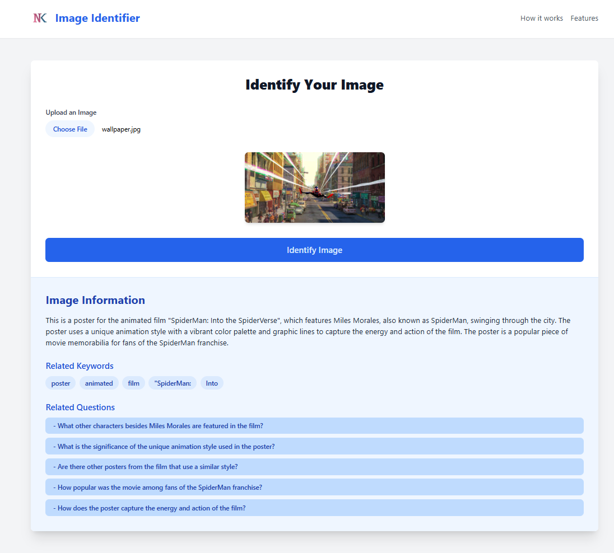

<h1 align="center">Image Analyzer</h1>

> Check out My Live project: <a href="https://nk-image-ai-analyzer.vercel.app/" target="_blank">Image Analyzer</a>

> Check out My portfolio: [Portfolio](https://nirmalkumarofllll.github.io/Portfolio/)

## Login

 
The Image Analyzer project is an innovative AI-driven application designed to enhance user interaction by leveraging the capabilities of the Gemini API. This tool allows users to upload images, which are then analyzed to extract relevant keywords and generate related content. Upon clicking any of the suggested keywords, the application seamlessly creates detailed textual content tailored to that keyword, offering users in-depth information and insights. Additionally, the project identifies related questions tied to the keywords, fostering a more comprehensive understanding of the subject matter. When users engage with these questions, the app generates content that addresses the inquiries, providing informative and contextually relevant answers. This dual functionality not only enriches the user experience but also facilitates learning and exploration through visual content. The interface is designed to be user-friendly, ensuring that users can easily navigate through their uploaded images and the generated keywords or questions. Built using .tsx files and .env configurations, the application maintains a robust structure that supports scalability and performance. The integration with Firebase allows for efficient data management and real-time updates, making the content generation process dynamic and responsive. Users benefit from a rich database of related topics and questions, enabling a deeper dive into their areas of interest. As they interact with the application, they can expect an engaging and informative experience, whether they are seeking to understand an image, find related concepts, or generate content for educational or creative purposes. This project exemplifies the potential of AI in bridging visual media with textual information, ultimately enhancing learning and engagement across various domains. With continuous updates and improvements planned for the future, the Image Analyzer aims to become a leading tool in AI-driven content generation and image analysis, catering to a diverse audience from students to professionals seeking to enrich their knowledge base.

> Learn How to do this project: [Project](https://nirmalkumarofllll.github.io/Portfolio/Image_Analyzer.html)
